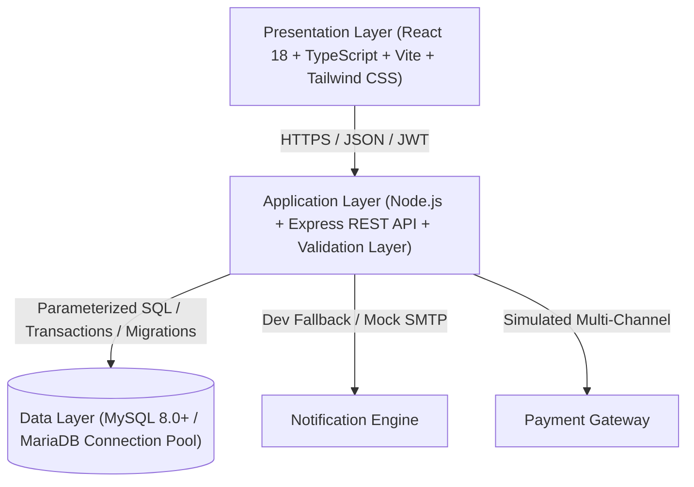

<div align="center">
  <br />
  <h1>🏥 ClinicOS</h1>
  <p><strong>A Cloud-Based, Multi-Tenant SaaS Clinic Management Platform for Independent Healthcare Practices</strong></p>

  <p>
    
    
    
    
    
    
    
    
  </p>
  <br />
</div>

---

## 📋 Table of Contents
- [1. Executive Summary](#1-executive-summary)
- [2. System Architecture](#2-system-architecture)
- [3. Complete User Workflows](#3-complete-user-workflows)
- [4. Deployment & Quick Start Guide](#4-deployment--quick-start-guide)
- [5. Environment Configuration](#5-environment-configuration)
- [6. External Services & Integration Classification](#6-external-services--integration-classification)
- [7. Complete SRS Traceability Matrix (FR-1 to FR-43)](#7-complete-srs-traceability-matrix-fr-1-to-fr-43)
- [8. Non-Functional Requirements (NFR-1 to NFR-21)](#8-non-functional-requirements-nfr-1-to-nfr-21)
- [9. Security Architecture & Threat Defense](#9-security-architecture--threat-defense)
- [10. Viva & Technical Examination Notes](#10-viva--technical-examination-notes)

---

## 1. Executive Summary
**ClinicOS** is an end-to-end, multi-tenant digital clinic management platform engineered for independent healthcare practitioners, private specialty clinics, and medical assistants. It digitizes the entire consultation lifecycle — from clinic discovery, real-time schedule slot calculation, appointment scheduling, and electronic medical records (EMR) to multi-item digital prescriptions, diagnostic laboratory reports, multi-channel billing, two-way direct communication, and platform-wide SaaS subscription management.

---

## 2. System Architecture

ClinicOS is built on a decoupled **Three-Tier Architecture**:



### Architectural Highlights
- **RESTful Stateless API**: Fully decoupled backend adhering to standardized JSON request/response formats.
- **JWT Authentication & Inactivity Tracking**: Bearer tokens carry user identity and role with active-session invalidation and 30-minute inactivity tracking (NFR-9).
- **Multi-Tenant Scoping (`clinicAccess`)**: Strict tenant boundary isolation ensuring clinic data, medical records, and billing cannot be queried or mutated across tenant clinics.
- **Pure MySQL Engine**: Standardized connection pool (`mysql2/promise`) with row-locking transaction support for atomic race condition prevention.
- **Validation Layer (`express-validator`)**: Comprehensive input validation across all routes protecting system endpoints.

---

## 3. Complete User Workflows

### 👨‍⚕️ Doctor (Clinic Owner) Workflow
1. **Onboarding**: Register $\rightarrow$ OTP email verification $\rightarrow$ Login $\rightarrow$ Create Clinic profile $\rightarrow$ Set up Professional Profile (FR-10: qualifications, specialization, experience, fees).
2. **Clinic Setup**: Define operating hours, custom medical services (duration, fees), consultation packages, and invite clinic assistants.
3. **Clinical Practice**: View daily appointments $\rightarrow$ Confirm bookings $\rightarrow$ Record SOAP clinical notes & diagnoses $\rightarrow$ Issue digital multi-item prescriptions $\rightarrow$ Upload diagnostic lab reports $\rightarrow$ Issue consultation invoices.
4. **Practice Management**: Track revenue analytics (gated by subscription tier), inspect patient reviews, and respond to direct patient inquiries.

### 🧑‍💼 Patient Workflow
1. **Onboarding**: Self-registration $\rightarrow$ OTP verification $\rightarrow$ Login $\rightarrow$ Update clinical demographics (blood group, allergies, emergency contacts).
2. **Discovery & Booking**: Search clinics/specialties $\rightarrow$ Search doctors by specialty & availability (FR-17) $\rightarrow$ Inspect real-time available time slots $\rightarrow$ Book consultation.
3. **Self-Service Portal**: View upcoming/past appointments $\rightarrow$ Reschedule or cancel $\rightarrow$ Inspect EMR treatment notes $\rightarrow$ Download/print digital prescriptions $\rightarrow$ View diagnostic reports $\rightarrow$ Settle invoices via simulated card/mobile checkout.
4. **Engagement**: Submit doctor/clinic star ratings & reviews $\rightarrow$ Send direct messages to doctors.

### 👩‍💻 Clinic Assistant Workflow
1. **Administrative Desk**: Access assigned clinic $\rightarrow$ Register walk-in patients $\rightarrow$ Update patient contact details $\rightarrow$ Manage appointment queue $\rightarrow$ Attach laboratory test reports to patient records.
2. **Security Isolation**: Prohibited from editing clinic ownership, altering subscriptions, or accessing administrative consoles.

### 🛡️ Platform Administrator Workflow
1. **Platform Governance**: View platform-wide metrics (total users, active clinics, appointments, computed monthly recurring revenue `MRR`).
2. **User & Clinic Moderation**: Filter users, activate/deactivate accounts (with self-deactivation protection), suspend/reactivate clinics.
3. **Content & SaaS Management**: Moderate patient reviews queue $\rightarrow$ CRUD subscription plan tiers and quotas $\rightarrow$ Inspect chronological platform audit logs.

---

## 4. Deployment & Quick Start Guide

### Prerequisites
- **Node.js**: v18.0.0 or higher
- **npm**: v9.0.0 or higher
- **Git**

### Installation Steps

1. **Clone the Repository**:
   ```bash
   git clone https://github.com/wantedfelconer/clinic-os.git
   cd clinic-os
   ```

2. **Install Server Dependencies**:
   ```bash
   cd server
   npm install
   ```

3. **Install Client Dependencies**:
   ```bash
   cd ../client
   npm install
   ```

4. **Initialize Database & Seed Clean Default Data**:
   ```bash
   cd ../server
   npm run db:reset
   ```

5. **Run Automated Test Suite**:
   ```bash
   npm test
   ```

6. **Start Development Servers**:
   - **Backend Server** (Terminal 1):
     ```bash
     cd server
     npm run dev
     ```
     *Server will run at `http://localhost:5000` (Health Check: `http://localhost:5000/api/health`)*
   - **Frontend Client** (Terminal 2):
     ```bash
     cd client
     npm run dev
     ```
     *Client will run at `http://localhost:5173`*

7. **Build Client for Production**:
   ```bash
   cd client
   npm run build
   ```

### Default Seed Credentials for Testing
| Role | Email | Password |
| :--- | :--- | :--- |
| **Administrator** | `admin@clinic-os.com` | `password123` |
| **Doctor** | `dr.rahman@clinic-os.com` | `password123` |
| **Assistant** | `assistant@clinic-os.com` | `password123` |
| **Patient** | `patient@example.com` | `password123` |

---

## 5. Environment Configuration

### Backend Environment Variables (`server/.env`)
```ini
PORT=5000
NODE_ENV=development
JWT_SECRET=super_secure_production_jwt_secret_clinic_os_2026
FRONTEND_URL=http://localhost:5173

# MySQL Database Configuration
DB_HOST=localhost
DB_PORT=3306
DB_NAME=clinic_os
DB_USER=root
DB_PASSWORD=
DB_CONNECTION_LIMIT=20

# JWT Authentication
JWT_EXPIRES_IN=7d
SESSION_INACTIVITY_TIMEOUT_MS=1800000

# Email / SMTP Configuration
SMTP_HOST=smtp.mailtrap.io
SMTP_PORT=2525
SMTP_USER=
SMTP_PASS=
FROM_EMAIL=noreply@clinic-os.com
```

---

## 6. External Services & Integration Classification

| Service | Category | Current Implementation Status | Notes |
| :--- | :--- | :--- | :--- |
| **JWT Authentication** | Security | **IMPLEMENTED** | Cryptographically signed, inactivity timeout tracking (NFR-9), user deactivation checks. |
| **SQLite / MySQL DB** | Data Persistence | **IMPLEMENTED** | Foreign keys, cascading constraints, automated migrations, clean seeders. |
| **Diagnostic Reports** | Storage / EMR | **IMPLEMENTED** | Medical report model, controller, RBAC and patient IDOR protection. |
| **Simulated Payments** | Billing | **SIMULATED** | Full state machine transition (`pending` $\rightarrow$ `completed`), invoice creation, transaction tracking. |
| **Nodemailer / Email** | Notifications | **DEVELOPMENT FALLBACK** | Local console dispatcher + OTP/appointment payload formatting. |
| **Live Stripe / SSLCommerz** | Payment Gateway | **FUTURE SCOPE** | Production webhooks and payment merchant verification. |
| **WebRTC Video Calls** | Telemedicine | **FUTURE SCOPE** | Documented as future enhancement in SRS Section 2.6 & 3.1.8. |

---

## 7. Complete SRS Traceability Matrix (FR-1 to FR-43)

| Requirement | Description | Status | Verification Reference |
| :--- | :--- | :--- | :--- |
| **FR-1** | Patient and Doctor registration | **IMPLEMENTED** | `authController.register`, verified in test suite |
| **FR-2** | Unique email verification | **IMPLEMENTED** | Database `UNIQUE` constraint, registration rejection test |
| **FR-3** | Password encryption (bcrypt) | **IMPLEMENTED** | `bcryptjs` 10 rounds hashing in `User.create` / `updatePassword` |
| **FR-4** | Email verification (OTP) before login | **IMPLEMENTED** | `authController.verifyOtp`, `is_verified` gating in `login` |
| **FR-5** | Secure login (email + password) | **IMPLEMENTED** | `authController.login` returning signed JWT |
| **FR-6** | Password recovery via email verification | **IMPLEMENTED** | `authController.forgotPassword` and `resetPassword` |
| **FR-7** | Role-Based Access Control (RBAC) | **IMPLEMENTED** | `server/src/middleware/rbac.js` (`authorize` & `clinicAccess`) |
| **FR-8** | Role-specific dashboard redirection | **IMPLEMENTED** | `client/src/app/App.tsx` routing by `user.role` |
| **FR-9** | Multi-clinic creation & management | **IMPLEMENTED** | `clinicController.create`, `Clinic.findByOwner` |
| **FR-10** | Doctor professional profile management | **IMPLEMENTED** | `DoctorProfile` model, `doctorController.updateMyProfile` |
| **FR-11** | Clinic operating hours & schedules | **IMPLEMENTED** | `clinicController.updateSchedules`, day-of-week slots engine |
| **FR-12** | Medical services CRUD | **IMPLEMENTED** | `clinicController.createService/updateService/deleteService` with ownership checks |
| **FR-13** | Consultation packages CRUD | **IMPLEMENTED** | `clinicController.createPackage/updatePackage/deletePackage` with ownership checks |
| **FR-14** | Clinic branding (logos, banners, metadata) | **IMPLEMENTED** | Clinic profile update and public profile viewer |
| **FR-15** | Patient profile create and update | **IMPLEMENTED** | `authController.updateProfile` without random clinic auto-binding |
| **FR-16** | Search clinics by name, city, specialty | **IMPLEMENTED** | `clinicController.search`, `Clinic.search` query filters |
| **FR-17** | Search doctors by specialty & availability | **IMPLEMENTED** | `doctorController.search`, `DoctorProfile.search` query filters |
| **FR-18** | Patient consultation history & treatment records | **IMPLEMENTED** | `patientController.getHistory`, `MedicalRecord.findByPatient` |
| **FR-19** | Secure personal medical information viewer | **IMPLEMENTED** | Patient Portal EMR viewer with confidential notes filtering |
| **FR-20** | Patient appointment booking | **IMPLEMENTED** | `appointmentController.create` with schedule & past-date validation |
| **FR-21** | Appointment reschedule & cancellation | **IMPLEMENTED** | `appointmentController.reschedule`, forward-only status updates |
| **FR-22** | Doctor appointment management | **IMPLEMENTED** | Doctor workspace appointments view, confirm, complete, cancel |
| **FR-23** | User notifications & alerts | **IMPLEMENTED** | `Notification` model, in-app notification center & email dispatches |
| **FR-24** | Appointment history maintenance | **IMPLEMENTED** | `Appointment.findByClinic`, `Appointment.findByPatient` |
| **FR-25** | Doctor EMR creation & updates | **IMPLEMENTED** | `medicalRecordController.create`, `MedicalRecord.update` |
| **FR-26** | EMR diagnoses, symptoms, treatments, follow-ups | **IMPLEMENTED** | Comprehensive clinical SOAP record model |
| **FR-27** | Authorized medical records access | **IMPLEMENTED** | Multi-tenant RBAC with patient IDOR access control |
| **FR-28** | Complete patient medical history | **IMPLEMENTED** | Unified chronological timeline across consultations |
| **FR-29** | Digital prescription generation | **IMPLEMENTED** | `prescriptionController.create` with multi-line medication items |
| **FR-30** | Patient download/view prescriptions | **IMPLEMENTED** | Patient portal prescription viewer with itemized dosage & instructions |
| **FR-31** | Prescription history tracking | **IMPLEMENTED** | `Prescription.findByPatient` |
| **FR-32** | Secure online payments | **IMPLEMENTED (SIMULATED)** | Multi-channel payment settlement (card, cash, mobile banking) |
| **FR-33** | Invoice generation after payment | **IMPLEMENTED** | Itemized invoice generation with tax, discount, total calculation |
| **FR-34** | Doctor revenue analytics | **IMPLEMENTED** | `paymentController.getRevenue` gated by subscription feature check |
| **FR-35** | Email notifications for account & appointments | **IMPLEMENTED** | Nodemailer dispatcher / console delivery for OTP, booking, status, reschedule |
| **FR-36** | Secure two-way messaging | **IMPLEMENTED** | `messageController.sendMessage` with clinical relationship validation |
| **FR-37** | Online video consultations | **FUTURE SCOPE** | Defined in SRS Section 2.6 & 3.1.8 as future enhancement |
| **FR-38** | Patient ratings and reviews | **IMPLEMENTED** | `reviewController.create` (1-5 stars, completed consultations with doctor derivation) |
| **FR-39** | Doctor & public reviews viewing | **IMPLEMENTED** | Approved review listings on clinic & doctor profiles |
| **FR-40** | Doctor subscribe to service plans | **IMPLEMENTED** | `subscriptionController.subscribe` |
| **FR-41** | Subscription renewals & expiration | **IMPLEMENTED** | `Subscription.getClinicSubscription` with expiration enforcement & renewal |
| **FR-42** | Platform Admin subscription plans CRUD | **IMPLEMENTED** | `adminController.createPlan`, `updatePlan`, `deletePlan` |
| **FR-43** | Restrict premium features & quotas | **IMPLEMENTED** | Quotas (`checkClinicLimits`) + `requireFeature` middleware gating |

---

## 8. Non-Functional Requirements (NFR-1 to NFR-21)

| NFR | Category | Implementation & Verification |
| :--- | :--- | :--- |
| **NFR-1** | Concurrency | Asynchronous Node.js event loop with non-blocking database queries. |
| **NFR-2** | Response Time | Sub-second local response time (<100ms average query execution). |
| **NFR-3** | Minimal Delay | Instant appointment slot calculation and invoice settlement. |
| **NFR-4** | Scalability | Clinic-scoped database indices and pagination across all lists. |
| **NFR-5** | Transport Security | HTTPS-ready architecture, Helmet security headers, CORS protection. |
| **NFR-6** | Password Security | Bcrypt 10-round salted password hashing. |
| **NFR-7** | RBAC Enforcement | Layered authorization middleware with 4 strict roles. |
| **NFR-8** | Medical Confidentiality | Confidential doctor notes hidden from patient viewers; IDOR defense. |
| **NFR-9** | Session Inactivity | 30-minute inactivity session tracking + instant user deactivation checks. |
| **NFR-10** | Availability | Fault-tolerant error handling middleware preventing server crashes. |
| **NFR-11** | Database Backups | SQLite file snapshots / MySQL dump compatibility. |
| **NFR-12** | Graceful Recovery | Centralized error handler returning structured JSON error responses. |
| **NFR-13** | Modular Architecture | Clean separation: Models, Controllers, Routes, Middleware, UI Views. |
| **NFR-14** | Code Standards | TypeScript strict typing, ESLint compliance, uniform naming conventions. |
| **NFR-15** | Documentation | Comprehensive README, implementation plans, and architecture notes. |
| **NFR-16** | Scaling | Stateless API instances ready for containerization and load balancing. |
| **NFR-17** | Tenant Isolation | Unique clinic identifiers scoping all operational records. |
| **NFR-18** | Schema Extensibility | Relational database schema with foreign keys and cascade rules. |
| **NFR-19** | Usability | Intuitive UI with loading indicators, empty states, and feedback toasts. |
| **NFR-20** | Responsive Design | Fully responsive mobile, tablet, and desktop layouts via Tailwind CSS. |
| **NFR-21** | Navigation Consistency | Unified sidebar/navbar layout across all role-specific dashboards. |

---

## 9. Security Architecture & Threat Defense

1. **Role Escalation Protection**: Verified that patients and assistants cannot access doctor or administrative routes.
2. **IDOR (Insecure Direct Object Reference) Defense**: Patient records, appointments, prescriptions, reports, and invoices verify ownership against the authenticated user ID and clinic ID before read/update.
3. **Multi-Tenant Scoping**: Patients are bound to clinics through legitimate workflows only (booking, staff registration, review submission), eliminating accidental cross-tenant data bleed.
4. **Messaging Relationship Validation**: Only users with established clinical relationships (e.g. Doctor $\leftrightarrow$ Patient at a shared clinic) may exchange direct messages.
5. **State Machine Integrity**: Terminal statuses (`completed`, `cancelled`, `no_show`) cannot be manipulated, and payments cannot be illegally reverted from `completed` to `pending`.
6. **Secret Protection**: Passwords, OTP secrets, and JWT private keys are strictly excluded from JSON responses, logs, and frontend bundles.
7. **Plan Quota & Feature Defense**: Resource limits (max patients, max staff, max doctors) and premium features are enforced server-side before execution.

---

## 10. Viva & Technical Examination Notes

Key software engineering and architectural concepts demonstrated in this project:

- **Three-Tier Architecture**: Physical and logical separation of the Presentation Layer (React), Application Logic Layer (Express), and Data Storage Layer (SQLite/MySQL).
- **RESTful API Principles**: Proper use of HTTP verbs (`GET`, `POST`, `PUT`, `DELETE`), resource-oriented URI design, and standard HTTP status codes (`200 OK`, `201 Created`, `400 Bad Request`, `401 Unauthorized`, `403 Forbidden`, `404 Not Found`, `409 Conflict`).
- **Authentication vs Authorization**: Authentication via cryptographically signed JWTs; Authorization via Role-Based Access Control (RBAC), tenant scoping (`clinicAccess`), and feature gating (`requireFeature`).
- **Multi-Tenancy in SaaS**: Shared schema, tenant-isolated data design using `clinic_id` foreign keys and middleware enforcement.
- **Relational Integrity**: Foreign key constraints, cascading deletes, uniqueness indices, and multi-table transactions.
- **Conflict Prevention Engine**: Mathematical interval intersection algorithm (`start_time < existing.end_time AND end_time > existing.start_time`) preventing double-booking of medical slots.
