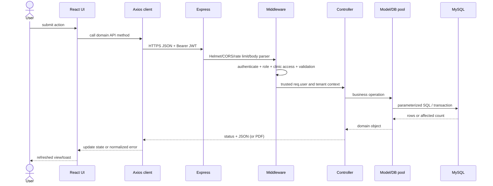
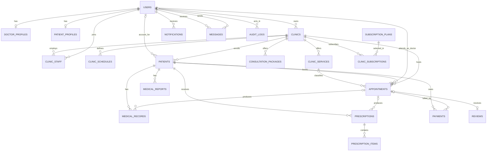

# ClinicOS: Technical Documentation and Viva Defense Guide

> **Status:** Repository-grounded documentation, verified against the source tree on 4 September 2026.  
> **Authoritative implementation:** React 18.3 + Vite 6.3 + TypeScript + Tailwind CSS 4 on the client; Node.js 18+ + Express 4.21 + MySQL 8/MariaDB through `mysql2/promise` on the server.  
> **Important correction:** `server/db/schema.sql` defines **23 physical tables**, although the source prompt groups them into 16–17 business areas. This guide documents all 23. The current client PDF generator uses direct jsPDF drawing; `html2canvas` is installed but is not used by `prescriptionPdf.ts`.

## Contents

1. [Executive Summary and System Architecture](#section-1-executive-summary-and-system-architecture)
2. [Authoritative Database Schema and Data Dictionary](#section-2-authoritative-database-schema-and-data-dictionary)
3. [Feature-by-Feature Implementation and Codebase Map](#section-3-feature-by-feature-implementation-and-codebase-map)
4. [Team Workload and Individual Defense Guides](#section-4-team-workload-and-individual-defense-guides)
5. [Code and Algorithm Deep Dives](#section-5-code-and-algorithm-deep-dives)
6. [Viva Defense Masterclass](#section-6-viva-defense-masterclass)

---

# Section 1: Executive Summary and System Architecture

## 1.1 What ClinicOS is

ClinicOS is a multi-tenant clinic-management SaaS for independent doctors and outpatient clinics. It replaces paper records, informal messaging, and manual queues with one system for clinic setup, staff, schedules, services, patient enrollment, appointments, electronic medical records, prescriptions, reports, invoices, reviews, messages, notifications, subscriptions, and platform administration.

“Multi-tenant” means one application and database serve many clinics. A tenant is a row in `clinics`; most operational rows carry `clinic_id`. Isolation is not obtained merely by hiding data in the UI. Protected requests pass through `authenticate`, role checks, and `clinicAccess`, and model queries constrain data by clinic. This is the central security boundary.

## 1.2 Technology truth matrix

| Tier | Verified technology | Important packages | Why it fits |
|---|---|---|---|
| Client | React 18.3.1, TypeScript, Vite 6.3.5, Tailwind 4.1.12 | Axios, Radix UI, Lucide, MUI, date-fns, Recharts, jsPDF | Reactive SPA, typed API integration, rapid component composition, fast builds, local charts and documents. |
| Server | Node.js 18+, Express 4.21 | Helmet, CORS, rate-limit, express-validator, jsonwebtoken, bcryptjs, crypto, multer | Non-blocking request handling and a transparent middleware/route/controller pipeline. |
| Data | MySQL 8+/MariaDB, InnoDB, `mysql2/promise` | Prepared parameters, pool, explicit transactions | ACID transactions, foreign keys, constraints, joins and row-level locking suit connected clinical and financial data. |
| Security | Defense in depth | HS256 JWT, bcrypt, hashed OTP, HTTPS enforcement, allowlisted CORS, RBAC, tenant checks, audit logs | A failed UI check does not bypass server authorization; input, identity, tenancy, state and persistence are independently checked. |
| Documents | jsPDF on client; a simple server PDF utility for API downloads | jsPDF 4.2, `server/src/utils/pdf.js` | Client creates styled prescriptions; server can return text receipts/prescriptions without trusting the browser. |

SQLite and MongoDB are not runtime databases. MySQL is the sole authoritative database implementation.

## 1.3 Repository architecture

```text
clinic-os/
├── client/src/
│   ├── app/App.tsx                 # main shell and staff workspace
│   ├── app/api/                    # Axios client and domain API adapters
│   ├── app/components/             # workflow modals and prescription document
│   └── modules/                    # auth, patient, admin, appointment views
├── server/src/
│   ├── index.js                    # Express composition root and route mounting
│   ├── config/                     # database, security and feature configuration
│   ├── middleware/                 # authentication, RBAC, subscription, errors
│   ├── routes/                     # URL + middleware + controller declarations
│   ├── controllers/                # permissions and business orchestration
│   ├── models/                     # parameterized SQL/data access
│   ├── validators/                 # request validation
│   ├── services/                   # appointment reminder worker
│   └── utils/                      # time, email, audit and PDF helpers
└── server/db/schema.sql            # authoritative DDL
```

Some backend domains also appear under `server/src/modules/`. The running composition root imports the files under `server/src/routes`, whose controllers import the root `models`; therefore those root paths are the primary runtime map.

## 1.4 End-to-end request lifecycle



At startup, `server/src/index.js` validates JWT and HTTPS configuration, installs Helmet, HTTPS redirect/HSTS behavior, an explicit CORS allowlist, two API rate limiters, parsers and development logging. It then mounts domain routers. The last two layers are a JSON 404 and centralized error handler.

`client/src/app/api/client.ts` sets `/api` (or `VITE_API_URL`) as the base URL, adds the stored bearer token, uses a 15-second timeout, normalizes common errors, and clears `clinic_os_*` storage plus emits `auth:expired` on HTTP 401.

## 1.5 Authentication, authorization and tenancy

- **Authentication:** `authenticate` verifies the JWT using configured secret, HS256 only, issuer and audience; applies inactivity timeout; reloads the user; rejects deleted, inactive, or unverified accounts; then assigns `req.user`.
- **Role authorization:** `authorize(...roles)` rejects roles outside the route’s allowlist.
- **Tenant authorization:** `clinicAccess` resolves a clinic identifier from route/body/query, verifies clinic state, then proves ownership, active staff membership, or a narrowly permitted patient relationship. Controllers still validate resource ownership.
- **Owner-only operations:** `requireClinicOwner` protects clinic settings/staff operations.
- **Plan gates:** `requireFeature` and `requireSharedClinicFeature` check subscription capabilities.
- **SQL injection defense:** models use `?` parameters with `execute/query`; allowed dynamic fields are explicit allowlists.
- **Anti-IDOR:** access is derived from `req.user` and verified clinic/patient relationships, not from trusting an ID supplied by the browser.

## 1.6 Deployment and runtime boundaries

The root build delegates to the Vite client. `api/index.js` exposes the Express app for serverless deployment, while `server/src/index.js` starts a long-running listener outside tests/Vercel and starts the reminder worker. Database connections use a reusable promise pool (default 20 locally, 10 on Vercel), optional verified TLS, keepalive, and a dedicated connection per transaction.

---

# Section 2: Authoritative Database Schema and Data Dictionary

## 2.1 Design rules

All IDs are UUID-shaped `VARCHAR(36)` values generated in application code. InnoDB supplies transactions and foreign keys. `utf8mb4` supports full Unicode. Monetary values use `DECIMAL(10,2)`, not floating-point database columns. Timestamps are generally created/updated by MySQL. CHECK constraints express legal enums and ranges; unique keys encode business invariants.

The schema is broadly normalized: identities, profiles, tenants, memberships, appointments, prescription headers/items, and plans/subscriptions are separated. This avoids repeating user credentials, clinic details, or medication columns in unrelated rows.

## 2.2 Complete data dictionary (23 tables)

| Table | Purpose and important columns | Keys, constraints and relationships |
|---|---|---|
| `users` | Global identity: email, bcrypt `password`, role, names, phone/avatar, verification/activity flags, refresh/reset/OTP material, timestamps. | PK `id`; unique `email`; role CHECK. Parent of profiles, clinics, staff and clinical actor references. |
| `doctor_profiles` | One doctor’s qualifications, specialization, experience, fee and bio. | PK `id`; unique FK `user_id → users` with cascade: true one-to-one extension. |
| `clinics` | Tenant: owner, identity/slug, contact, address/geolocation, timezone, branding and active flag. | PK `id`; unique `slug`; FK `owner_id → users` cascade. |
| `clinic_staff` | Membership junction between users and clinics, with doctor/assistant role and active state. | PK `id`; unique `(clinic_id,user_id)`; both FKs cascade. |
| `clinic_schedules` | One availability window for each weekday (`0` Sunday–`6` Saturday). | PK `id`; unique `(clinic_id,day_of_week)`; clinic FK cascade; day CHECK. |
| `clinic_services` | Tenant service catalog with duration, price and active flag. | PK `id`; clinic FK cascade; referenced by appointments. |
| `consultation_packages` | Tenant bundles with session count and price. | PK `id`; clinic FK cascade. Used for subscription-gated package management and invoice pricing. |
| `patients` | A clinic-scoped chart/enrollment, including demographics, allergies, chronic conditions and emergency contact. `user_id` may be null for walk-ins. | PK `id`; clinic FK cascade; user FK `ON DELETE SET NULL`; gender CHECK. A user may have records in several clinics. |
| `patient_profiles` | Clinic-independent demographic profile for a patient account. | PK/FK `user_id → users` cascade; one-to-one. |
| `appointments` | Visit booking: tenant, patient, doctor, optional service, local date/times, status/type, notes, cancellation and reminder timestamp. | PK `id`; FKs to clinic/patient/doctor/service; status/type CHECKs. Composite conflict and reminder indexes. |
| `medical_records` | EMR note: diagnosis, symptoms, treatment plan, notes, follow-up and confidentiality. | PK `id`; FKs to patient, clinic, doctor and optional appointment. Confidentiality index aids filtering. |
| `prescriptions` | Prescription header: patient, clinic, doctor, optional appointment, diagnosis, notes, active state. | PK `id`; four relational FKs; parent of items. |
| `prescription_items` | Repeatable medication line: name, dose, frequency, duration, route, instructions. | PK `id`; FK `prescription_id → prescriptions ON DELETE CASCADE`, preventing orphan lines. |
| `medical_reports` | Report metadata: patient/clinic, optional doctor, uploader, title/type, file name/URL, description and report date. | PK `id`; patient and clinic cascade; doctor/uploader reference users. Actual file bytes are outside this table. |
| `payments` | Invoice/ledger: appointment, authoritative amount/discount/tax/total, method, state, transaction and receipt data. | PK `id`; unique invoice and receipt numbers; FKs to clinic/patient/appointment; method/state CHECKs. |
| `reviews` | One rating/comment for a clinic/doctor/visit, plus moderation flag. | PK `id`; rating CHECK 1–5; unique `appointment_id` blocks duplicate visit reviews; relational FKs. |
| `subscription_plans` | SaaS plan price/cycle, quotas, JSON feature list and active state. | PK `id`; billing-cycle CHECK; referenced by subscriptions. |
| `clinic_subscriptions` | Clinic-plan enrollment, lifecycle dates/state, renewal and optional Stripe reference. | PK `id`; FKs to clinic and plan; state CHECK. |
| `notifications` | User alert with type, optional reference and read state. | PK `id`; user FK cascade; type CHECK. |
| `messages` | Direct sender/receiver subject/body and read state. | PK `id`; two user FKs; sender, receiver and conversation indexes. |
| `audit_logs` | Security/administrative event, actor, entity, JSON details and IP. | PK `id`; nullable user FK. Indexed by user and `(action,created_at)`. |

### Referential deletion behavior

Cascade is intentionally used for dependent tenant/profile rows; removing a clinic removes its scoped operational data. Deleting a user preserves walk-in-like patient charts by nulling `patients.user_id`. Several clinical/financial actor FKs have no explicit delete rule and therefore default to `RESTRICT`, protecting historical integrity. In normal operation, users/clinics are deactivated instead of physically deleted.

## 2.3 Entity relationship diagram



## 2.4 Performance and integrity indexes

The appointment conflict index begins with clinic, doctor, date and status before times, matching conflict predicates. Reminder processing is supported by `(reminder_sent_at, appointment_date, start_time, status)`. Tenant/patient indexes support scoped lists; payment state supports revenue/status filtering; the medical-record confidentiality index supports secure patient-history retrieval. Unique email/slug/invoice/receipt/review and junction keys are integrity rules, not merely speed optimizations.

---

# Section 3: Feature-by-Feature Implementation and Codebase Map

## 3.1 Registration, OTP verification and resend

**Paths:** `POST /api/auth/register`, `/verify-otp`, `/resend-otp` in `server/src/routes/authRoutes.js`; `register`, `verifyOTP`, `resendOTP` in `authController.js`; `User.js`; `authValidator.js`; `client/src/modules/auth/AuthPage.tsx`; `client/src/app/api/auth.ts`.

Registration validates and normalizes input, refuses duplicates, generates a cryptographically random six-digit OTP, hashes both password and OTP with bcrypt, stores the OTP expiry, and sends the plaintext code through the email boundary. Login remains blocked until `is_verified`. Verification checks format, expiry and bcrypt equality; five failures invalidate the code and lock attempts for 15 minutes. Resend has a 60-second cooldown and hourly cap. A successful patient verification links matching unclaimed clinic patient rows by email.

## 3.2 Login, session and password recovery

`POST /api/auth/login` compares bcrypt hashes, rejects unverified/inactive identities, signs HS256 JWT claims with issuer/audience and records audit events. `authenticate` enforces the token and a configurable 30-minute inactivity window. Recovery returns a generic response to prevent email enumeration, generates a 32-byte random one-hour reset token, stores it, emails it and clears it after password replacement. The client interceptor supplies the JWT and globally handles expiry.

**Caveat for defense:** activity and OTP attempt maps are process memory. They are appropriate for this deployment/demo but are not shared across horizontally scaled instances and disappear on restart. A production cluster should use Redis or another shared expiring store. Reset tokens are currently stored as plaintext; hashing them at rest would further harden production.

## 3.3 Clinic setup, staffing, services and packages

`clinicRoutes.js` exposes public search/detail/schedules/services/packages and authenticated creation, owner updates, branding, schedules, staff, dashboard and analytics. `clinicController` orchestrates `Clinic`, `Service`, `Package`, subscription gates and ownership. Staff membership is represented by `clinic_staff`, while the clinic owner is represented directly by `clinics.owner_id`. `App.tsx` supplies My Clinic, Services, Packages, Analytics and Settings views; `AddStaffModal` handles membership entry.

## 3.4 Appointment booking and scheduling

**Runtime paths:** clinic slots are `GET /api/clinics/:clinicId/available-slots`; appointments are under `/api/clinics/:clinicId/appointments` with list, create, upcoming, patient list, detail, status and reschedule endpoints. There is no separate `PUT /:id/cancel`; cancellation is a status update. The client uses `BookAppointmentModal`, `RescheduleModal`, `CancelAppointmentModal`, `appointmentsApi`, and staff/patient queues.

The controller validates the patient-clinic and doctor-clinic relationships, service, schedule, local clinic date/time and authorization. The model transaction queries overlapping active appointments with `FOR UPDATE`, inserts, then returns a joined view. Rescheduling performs conflict checks with the current appointment excluded. The reminder service selects upcoming unsent appointments and creates notifications.

## 3.5 Patient self-service portal

`client/src/modules/patient/PatientPortal.tsx` is the modular patient view (a legacy/inlined counterpart also remains in `App.tsx`). Its eight sections cover health summary, discovery, appointments, records, prescriptions, invoices, messages and profile. Patient API endpoints derive identity from `req.user.id` through `/api/auth/*` convenience endpoints or protected clinic routes, preventing a browser from claiming another account.

## 3.6 Doctor and assistant workspace

`client/src/app/App.tsx` contains the staff shell and 14 navigation items: Overview, Appointments, Patients, Medical Records, Prescriptions, Billing, My Clinic, Services, Packages, Analytics, Reviews, Notifications and Settings (with grouped headings). It loads active-clinic state and calls domain adapters. Server dashboard/analytics live in `clinicController.getDashboard` and `getAnalytics`; assistants receive only the permissions explicitly granted by route role lists.

## 3.7 EMR and medical reports

`medicalRecordRoutes.js`, `medicalRecordController.js`, `MedicalRecord.js` and `medicalRecordValidator.js` implement list/create/patient/detail/update. The UI modal is named `CreateEMRModal` (not `CreateMedicalRecordModal`) in `ActionModals.tsx`. The schema stores diagnosis, symptoms, plan and notes rather than four separately named SOAP columns; these fields map conceptually to assessment, subjective findings and plan. Confidential records are filtered according to actor/ownership rules.

Reports use `medicalReportRoutes.js`, controller/model/validator counterparts and `UploadMedicalReportModal`. The database stores metadata and URL, not a binary blob.

## 3.8 Digital prescriptions and PDF

Routes support clinic list, atomic creation, patient list, detail, server PDF, atomic update, item addition and deletion. `Prescription.createWithItems` commits the header and every item together. `PrescriptionDocument.tsx` renders preview content. `prescriptionPdf.ts` currently builds an A4 document directly using jsPDF drawing/text primitives, alternating medication rows, page breaks, notes and signature/footer; `printPrescription` uses an isolated iframe. The server `downloadPdf` is a separate authenticated fallback. This dual approach provides styled local export and server-enforced access.

## 3.9 Billing and simulated settlement

`paymentRoutes.js`, `paymentController.js`, `Payment.js`, `paymentValidator.js`, `CreateInvoiceModal`/`PayInvoiceModal`, and `paymentsApi` implement invoices. The server resolves service/package/appointment catalog prices; manual positive amount is an explicit fallback. It validates tenant/patient/appointment links, computes `base - discount + tax` to cents, blocks duplicate active appointment invoices, and creates identifiers server-side.

Settlement uses a finite state machine: pending → completed/failed; failed → pending; completed → refunded; refunded is terminal. A compare-and-set SQL update includes the expected old status, so concurrent settlement loses with 409 rather than silently overwriting. Successful simulated payments get random transaction and receipt references, audit records and patient notifications.

## 3.10 Reviews and moderation

Public clinic review listing and patient creation live in `reviewRoutes.js`; approval/deletion is admin-only. Creation verifies the patient relationship and eligible appointment. `UNIQUE(appointment_id)` is the final duplicate defense. `SubmitReviewModal`, staff review view and `AdminPanel` provide user flows.

## 3.11 Messaging and notifications

`messageRoutes.js`, `messageController.js` and message-related SQL enforce authenticated sending, eligible recipient discovery, inbox and read state. Messaging is also subscription-gated through a shared-clinic feature check. `notificationRoutes.js` delegates list/read functions to `authController`; `Notification.js` persists alerts. `SendMessageModal`, staff notifications and patient message screens are the client surfaces. It is asynchronous database messaging, not WebSocket chat.

## 3.12 Subscriptions and super-admin

Plan discovery and clinic subscription lifecycle are in `subscriptionRoutes.js`, `subscriptionController.js`, `Subscription.js` and subscription middleware. Admin routes are globally protected by `authenticate` and `authorize('admin')` before their declared handlers. `adminController` provides dashboard KPIs, users, clinics, reviews, plans, subscriptions and audit logs. `client/src/modules/admin/AdminPanel.tsx` offers six views. MRR is calculated telemetry from active subscriptions, not proof of real payment capture.

## 3.13 Representative HTTP data flows

```text
Patient books
PatientPortal → appointmentsApi.create → POST clinic/:id/appointments
→ authenticate → clinicAccess → appointmentValidator.create
→ appointmentController.create → Appointment.createTransactional
→ SELECT overlap FOR UPDATE → INSERT → JSON → refresh queue

Doctor prescribes
CreatePrescriptionModal → prescriptionsApi.create → protected clinic route
→ role doctor → tenant check → plan feature → validator
→ controller relationship checks → Prescription.createWithItems
→ BEGIN → header INSERT → N item INSERTs → COMMIT → notification

Patient settles
PayInvoiceModal → paymentsApi.updateStatus(completed)
→ authenticate → clinicAccess → validator → paymentController.updateStatus
→ own-invoice check → legal transition → compare-and-set UPDATE
→ receipt/audit/notification → refreshed invoice
```

---

# Section 4: Team Workload and Individual Defense Guides

The following is a balanced defense allocation, not Git-authorship evidence. Each member should understand shared middleware and end-to-end flows even when another member presents the feature.

## 4.1 Abdullah Al Noman — 23201356

**Scope:** architecture, database/bootstrap, authentication, OTP/recovery, security middleware and integration.  
**Files:** `server/src/index.js`, `config/{database,security}.js`, `middleware/{auth,rbac,errorHandler}.js`, `routes/authRoutes.js`, `controllers/authController.js`, `models/{User,DoctorProfile,AuditLog,Notification}.js`, `validators/authValidator.js`, `utils/{email,audit}.js`, `client/src/modules/auth/AuthPage.tsx`, `app/api/{client,auth}.ts`.  
**Tables:** users, doctor_profiles, patient_profiles, notifications, audit_logs.  
**Challenges:** safe JWT configuration, hashed expiring OTP, brute-force throttling, generic recovery responses, inactive-user eviction, tenant/RBAC composition.

**60-second pitch:** “I led the application architecture and identity security. I built the Express composition pipeline, pooled MySQL boundary, registration and hashed OTP verification, bcrypt login, issuer/audience-bound JWT sessions, recovery and audit logging. I separated authentication—who the user is—from authorization—what role and clinic they may access. Every protected request reloads the user, so deactivation takes effect before token expiry. On the client I implemented token attachment and global session-expiry handling. I also documented the scaling limitation of process-local activity tracking and the production path to a shared expiring store.”

**Five questions and model answers**

1. **Why bcrypt?** It salts automatically and is intentionally expensive, slowing password guessing unlike MD5/SHA-256.
2. **Why verify issuer, audience and algorithm?** Signature alone is insufficient; these constraints reject a valid token made for another service/client and prevent algorithm confusion.
3. **Can JWT logout/deactivation be immediate?** Deactivation is immediate because each request reloads `is_active`; process-local inactivity is checked independently. Explicit distributed revocation would require a shared denylist/session store.
4. **Why hash the OTP?** A database leak should not reveal a still-valid login-adjacent secret. bcrypt comparison verifies without storing plaintext.
5. **Authentication vs authorization?** Authentication establishes identity; RBAC and clinic membership decide permitted actions and tenant data.

## 4.2 Partho Probal — 24121287

**Scope:** clinics, schedules, staffing, services/packages, patient enrollment and appointment engine.  
**Files:** clinic/patient/appointment routes, controllers, models and validators; `utils/{dateTime,appointments}.js`; reminder service; `App.tsx`; appointment modals; `AddPatientModal.tsx`; API adapters for clinics/patients/doctors/appointments.  
**Tables:** clinics, clinic_staff, clinic_schedules, clinic_services, consultation_packages, patients, appointments.  
**Challenges:** multi-tenant membership, local-time validation, overlapping interval logic, concurrent booking, owner-only mutations and schedule-derived slots.

**Pitch:** “I implemented the tenant operations and scheduling core. A clinic owns schedules, services, packages, staff and patient charts. Booking validates every cross-tenant reference, checks clinic-local operating time and uses an explicit MySQL transaction. The overlap predicate catches any intersection and `FOR UPDATE` serializes conflicting changes. I connected this to patient booking and staff queues, status changes, rescheduling and reminders. My focus was that UI convenience never substitutes for server-side tenant and concurrency checks.”

1. **How is overlap detected?** Two half-open intervals overlap when existing start is before new end and existing end is after new start.
2. **Why not only check in React?** Two clients can observe the same free slot; only the authoritative database transaction can arbitrate concurrency.
3. **Owner vs staff?** Owner is `clinics.owner_id`; staff is a unique active `clinic_staff` membership with a scoped role.
4. **How are timezones handled?** The clinic timezone is authoritative and date/time utilities validate against its local clock; stored appointment fields are local DATE/TIME.
5. **What is an IDOR defense here?** Supplying another clinic/patient/doctor UUID is rejected because middleware/controllers verify their relationships to the active clinic and identity.

## 4.3 Rifat Abdullah Sarker — 23301144

**Scope:** EMR, confidentiality, prescriptions, medication items, reports and document output.  
**Files:** medical record/report/prescription routes, controllers, models and validators; `utils/pdf.js`; `PrescriptionDocument.tsx`; `prescriptionPdf.ts`; relevant ActionModals and API adapters.  
**Tables:** medical_records, prescriptions, prescription_items, medical_reports.  
**Challenges:** confidential record visibility, clinical relationship checks, atomic header-detail writes, repeatable dynamic medication UI, page-aware print/PDF layout.

**Pitch:** “I built the clinical documentation pipeline. Doctors can record structured consultation findings, mark sensitive records confidential, issue prescriptions with any number of medication rows and attach report metadata. Prescription headers and items are normalized and written in one ACID transaction, so partial prescriptions cannot survive failure. I produced authenticated retrieval and both client and server document paths. The client PDF is drawn as A4 with page breaks and clinic/doctor/patient metadata, while access to source data remains server-authorized.”

1. **Why two prescription tables?** One header has many repeatable items; normalization avoids repeated header data and enables item constraints/querying.
2. **What if item three fails?** The callback throws, the transaction helper rolls back header and earlier items, and releases the connection.
3. **Is the EMR literally SOAP columns?** Not exactly: symptoms, diagnosis, treatment plan and notes represent the clinical structure; the schema does not name four S/O/A/P columns.
4. **Why not store report files in MySQL?** URL/metadata keeps transactional records small; object storage/web delivery handles files more efficiently.
5. **Why two PDF paths?** Client output provides rich immediate presentation; server output provides an authenticated independent download boundary.

## 4.4 Md. Shafinuzzaman — 23201673

**Scope:** invoices/payments, reviews, messaging, subscriptions and super-admin telemetry.  
**Files:** payment/review/message/subscription/admin routes, controllers, models, validators and middleware; `AdminPanel.tsx`; billing/review/message/subscription/admin API adapters; relevant modals.  
**Tables:** payments, reviews, messages, subscription_plans, clinic_subscriptions.  
**Challenges:** authoritative price calculation, legal payment transitions, optimistic concurrency, review eligibility/moderation, relationship-scoped messaging, plan feature gates and global admin separation.

**Pitch:** “I implemented the financial and governance layer. Invoice values are reconstructed from tenant-owned catalog data and rounded server-side. Settlement follows a strict state machine and compare-and-set update, preventing concurrent duplicate completion; every change is audited and can notify the patient. I also implemented one-review-per-visit enforcement, relationship-limited messaging, subscription feature gates, and an admin console for platform KPIs, users, clinics, plans and audit logs. Payment capture is deliberately simulated, but the lifecycle and integrity boundaries are real.”

1. **What makes settlement concurrency-safe?** The SQL update requires both payment ID and previously read status; only one simultaneous request can affect a row.
2. **Is returning 400 for repeat completion idempotent?** It prevents duplicate effects but strict HTTP idempotency often returns the existing success; describe this as duplicate-settlement defense, not perfect idempotent response semantics.
3. **Why DECIMAL?** Binary floats cannot exactly represent many decimal currencies; DECIMAL preserves fixed-scale values.
4. **How is review spam limited?** Eligibility is checked in code and a unique appointment key makes the database the final one-review-per-visit authority.
5. **Is MRR real revenue?** It is plan-based telemetry for active subscriptions; simulated payments and an optional Stripe reference do not constitute a live gateway integration.

---

# Section 5: Code and Algorithm Deep Dives

## 5.1 Appointment conflict transaction

```js
return db.transaction(async (conn) => {
  const [conflicts] = await conn.execute(
    `SELECT id FROM appointments
     WHERE clinic_id = ? AND doctor_id = ? AND appointment_date = ?
       AND status NOT IN ('cancelled', 'no_show')
       AND start_time < ? AND end_time > ?
     FOR UPDATE`,
    [clinic_id, doctor_id, appointment_date, end_time, start_time]
  );
  if (conflicts.length) throw conflictError;
  await conn.execute(`INSERT INTO appointments (...) VALUES (...)`, values);
});
```

`db.transaction` checks out one pooled connection, begins, runs the callback, commits on success or rolls back on error, and always releases. The interval formula detects partial overlap, containment and identical slots, while allowing adjacent slots (10:00–10:30 and 10:30–11:00). Cancelled/no-show rows do not occupy capacity. `FOR UPDATE` holds locks until commit.

**Nuance:** locking existing matching rows is strongest when a matching index/range lock and InnoDB isolation protect the searched range; the composite index is designed for this. For an absolute invariant under every isolation/deployment choice, a discrete slot table with a unique key or another per-doctor/date locking row is even stronger. Do not call this an application “mutex”; it is transactional database locking.

## 5.2 Atomic prescription header/items

```js
await db.transaction(async (connection) => {
  await connection.execute('INSERT INTO prescriptions (...) VALUES (...)', header);
  for (const item of items) {
    await connection.execute('INSERT INTO prescription_items (...) VALUES (...)', line);
  }
});
```

The generated header ID becomes every line’s FK. Sequential `await` preserves error propagation. If any insert violates a constraint or the connection fails, the callback rejects; the transaction helper issues `ROLLBACK`, so neither header nor earlier lines remain. `ON DELETE CASCADE` also makes intentional prescription deletion clean. The normalized form supports unlimited medicines and independent querying without a JSON blob.

## 5.3 Payment state machine and compare-and-set

```js
const allowedTransitions = {
  pending: ['completed', 'failed'],
  failed: ['pending'],
  completed: ['refunded'],
  refunded: [],
};
const payment = await Payment.updateStatus(id, oldStatus, status, txn, receipt);
if (!payment) return res.status(409).json({ message: 'Payment status changed concurrently.' });
```

The dictionary makes legal transitions auditable. Patient actors may only complete their own pending invoice. Random simulated transaction/receipt identifiers are created for completion. In the model, the update includes `WHERE id = ? AND payment_status = ?`; affected rows zero means another request changed state after the read. This is optimistic concurrency: no long lock, but stale writers fail. Duplicate completed→completed is rejected before the transition check.

## 5.4 JWT and inactivity guard

```js
const decoded = jwt.verify(token, jwtConfig.secret, {
  algorithms: ['HS256'], issuer: jwtConfig.issuer, audience: jwtConfig.audience,
});
const lastActive = userActivityMap.get(decoded.id);
if (lastActive && Date.now() - lastActive > INACTIVITY_TIMEOUT_MS) return res.status(401)...;
const [rows] = await db.query(
  'SELECT ... is_verified, is_active FROM users WHERE id = ?', [decoded.id]
);
```

Verification checks cryptographic signature, expiry and token context. The map implements sliding inactivity: a valid request refreshes last activity; stale entries are periodically removed. The subsequent database read rejects accounts removed, unverified or deactivated after token issue. The trade-off is a DB read per protected request and process-local activity state; caching/shared sessions can optimize a scaled production system without weakening revocation semantics.

## 5.5 Prescription PDF generation

The implemented `downloadPrescriptionPdf` constructs `new jsPDF({ orientation: 'portrait', unit: 'mm', format: 'a4' })`, draws clinic and doctor headers, patient metadata, medication columns and alternating rows, uses `splitTextToSize`, inserts pages when `y > 235`, adds notes/footer/signature, and calls `doc.save`. This produces vector text and shapes—usually sharper and more searchable than a screenshot—and avoids server CPU and font/layout differences.

`printPrescription` separately creates a zero-size isolated iframe, writes print-specific A4 HTML, focuses/prints, and removes it. Because dynamic values are interpolated into HTML, production hardening should HTML-escape all user-controlled fields before `doc.write` to avoid markup injection. The prompt’s proposed 2× html2canvas off-screen clone is not the current algorithm.

---

# Section 6: Viva Defense Masterclass

## 6.1 How to discuss AI-assisted development

Say: “We used AI pair-programming to accelerate prototypes and boilerplate. We owned the requirements, relational model, tenant boundaries, security decisions, audits, corrections and tests. We can trace each user action from component to endpoint, middleware, controller, parameterized SQL and database constraint.” Never claim ownership you cannot demonstrate; technical ownership means understanding, testing and defending the result.

## 6.2 Ten trap questions and strong answers

1. **Why MySQL rather than MongoDB?** Clinical data is highly relational. MySQL supplies foreign keys, joins, ACID multi-row transactions, fixed-scale money and InnoDB locking. MongoDB can provide transactions, so do not claim it “cannot”; the defense is that the relational model is simpler and more natural here.
2. **How is tenant isolation enforced?** JWT identity enters `clinicAccess`, which verifies active clinic ownership/staff or an allowed patient relationship; controllers validate referenced resources and SQL scopes lists by `clinic_id`.
3. **Why store OTP server-side?** Server state supports expiry, one-time invalidation and throttling. The stored value is a bcrypt hash, so plaintext is not exposed by a database read.
4. **What if prescription item three fails?** The dedicated connection rolls the entire transaction back, removing the header and prior items.
5. **Why bcrypt instead of SHA-256?** Password hashing needs an intentionally slow, salted password KDF; fast general hashes make brute force cheap.
6. **Why simulated payments?** Commercial credentials and compliance are outside academic scope. The project still implements server pricing, state transitions, concurrency, receipts, audit and notifications. It must not be presented as real card processing.
7. **How are times handled?** Each clinic has a timezone used for validation and availability; appointments store a clinic-local date and times. A global system may instead store UTC instants plus timezone for DST-safe interoperability.
8. **Why hide confidential notes?** Least privilege: not every patient/staff role should receive sensitive working notes. Server filtering—not UI hiding—enforces this.
9. **What is IDOR?** Manipulating an object ID to access another user/tenant’s record. ClinicOS checks identity-to-tenant/resource relationships before returning data.
10. **Can `FOR UPDATE` alone guarantee no double booking?** It locks selected index records/ranges inside a transaction. The composite index and InnoDB behavior make it effective; the strongest schema-level alternative is a unique discrete-slot allocation or explicit lock row.

## 6.3 Additional examiner questions

- **MVC?** Routes declare transport/middleware, controllers orchestrate use cases, models isolate SQL, and React views are the presentation client. It is a pragmatic layered MVC-like architecture.
- **Why parameterized SQL?** User values remain data rather than executable SQL syntax. Dynamic filter/field names must still be allowlisted.
- **401 vs 403?** 401 means no valid authenticated identity; 403 means authenticated but not permitted.
- **400 vs 409?** 400 covers invalid request/state transitions; 409 is appropriate for a detected concurrent state conflict.
- **Why foreign keys plus application checks?** Application checks give meaningful authorization/errors; FKs are the final integrity boundary against invalid references.
- **Why soft deactivation?** Healthcare/financial history and auditability should survive account suspension; hard deletion risks broken history.
- **What would you improve first?** Shared Redis session/OTP throttles, hashed reset tokens, escaped print HTML, stronger slot uniqueness, migrations instead of replaying non-idempotent index DDL, automated CI and production observability.
- **Does the schema have exactly 16 tables?** No. It has 23 physical tables. “16” came from grouping related pairs/areas; always distinguish logical modules from physical tables.

## 6.4 Live demo protocol

1. Prepare verified patient, doctor and admin accounts and one active clinic/subscription.
2. Patient discovers clinic and books an available slot.
3. Doctor confirms visit, opens the patient, creates EMR and a multi-item prescription.
4. Patient refreshes, views records and exports the prescription.
5. Staff creates an invoice; patient performs simulated settlement; show receipt/state.
6. Patient submits review; admin moderates it and shows audit/platform telemetry.
7. Demonstrate one negative case: second booking overlap, cross-clinic ID, or repeated payment is rejected.

Keep seeded/test data only. Never expose `.env`, JWT secrets, real patient data or email credentials.

## 6.5 High-scoring presentation habits

- Start with the invariant: “every clinical row is related to an authenticated identity and tenant.”
- Navigate feature → route → middleware → controller → model → constraint, not randomly through files.
- Use precise terms: transaction, rollback, foreign key, optimistic concurrency, row/range lock, RBAC, IDOR and least privilege.
- Admit implementation boundaries accurately: simulated gateway, process-local inactivity, no real-time sockets, direct jsPDF rather than html2canvas.
- Explain trade-offs, not slogans. MySQL was selected because it fits this data model; React because the UI is stateful; client PDFs because presentation is immediate.
- If uncertain, state the invariant and inspect the source rather than inventing an answer.

## 6.6 Final one-minute system defense

“ClinicOS is a React and Express multi-tenant clinic SaaS backed exclusively by MySQL. React provides role-specific staff, patient and admin workspaces. Express composes transport security, JWT authentication, RBAC, clinic membership, validation and subscription gates before controllers execute. Models issue parameterized SQL through a pooled promise client, while foreign keys, unique keys, checks and transactions preserve integrity. The most important workflows are concurrency-aware: appointment creation locks overlapping ranges, prescriptions commit headers and items atomically, and payment settlement uses a legal state machine plus compare-and-set updates. The project covers the full outpatient loop while honestly separating production-ready integrity mechanisms from academic boundaries such as simulated payment capture and process-local session activity.”

---

## Source map for revision

When code changes, re-check these first: `server/db/schema.sql`, `server/src/index.js`, `server/src/config/{database,security}.js`, all root `routes`, `controllers`, `models`, `middleware`, and `validators`, plus `client/src/app/App.tsx`, `client/src/modules`, `client/src/app/api`, `ActionModals.tsx`, and `prescriptionPdf.ts`. The code is the source of truth; this guide must evolve with it.
